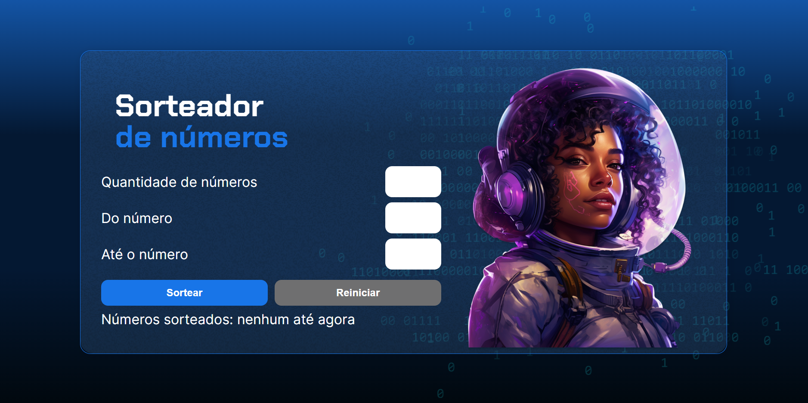
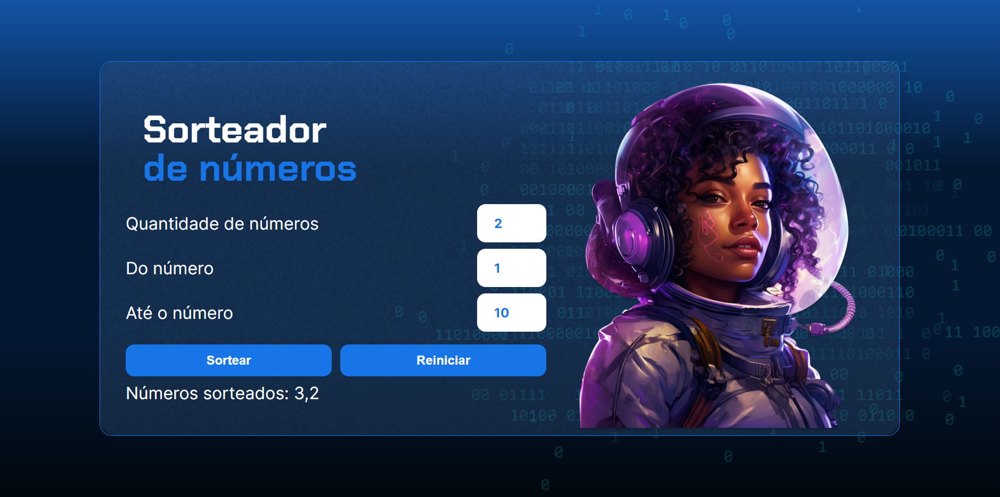

# Projeto Sortador de Números!

Projeto feito no curso "Lógica de programação: praticando com desafios" fornecido pela Alura por meio do projeto Geração Caldeira.

**🚀 Tecnologias utilizadas**

## EXPLICACAÇÃO DO PROJETO:

Na foto acima podemos ver 3 caixas para inserir valores, são elas:

<ol>
  <li>Quantidade de números:</li>
  <li>Do número:</li>
  <li>Até o número:</li>
</ol>

Respectivamente as caixas funcionam da seguinte forma:

<ol>
  <li>Recebe o número informado pelo usuário e o armazena em uma váriavel, ele serve para indicar quantos números terão que ser sorteados entre os outros números indicados nas próximas caixas.</li>
  <li>Recebe o primeiro número informado pelo usuário para servidr de parâmetro aos números que serão sorteados.</li>
  <li>Recebe o segundo número informado pelo usuário para servidr de parâmetro aos números que serão sorteados.</li>
</ol>

<h3>EXEMPLO:</h3>

No exemplo acima, temos como parâmetro para a quantidade de números sorteados igual á 2, podendo sortear esses número de 1 até 10.

Observe que no campo onde aparecia o texto "Números sorteados: nenhum até agora", depois de clicar no botão "SORTEAR", agora aparecem os números sorteados, respectivamente 3 e 2.

